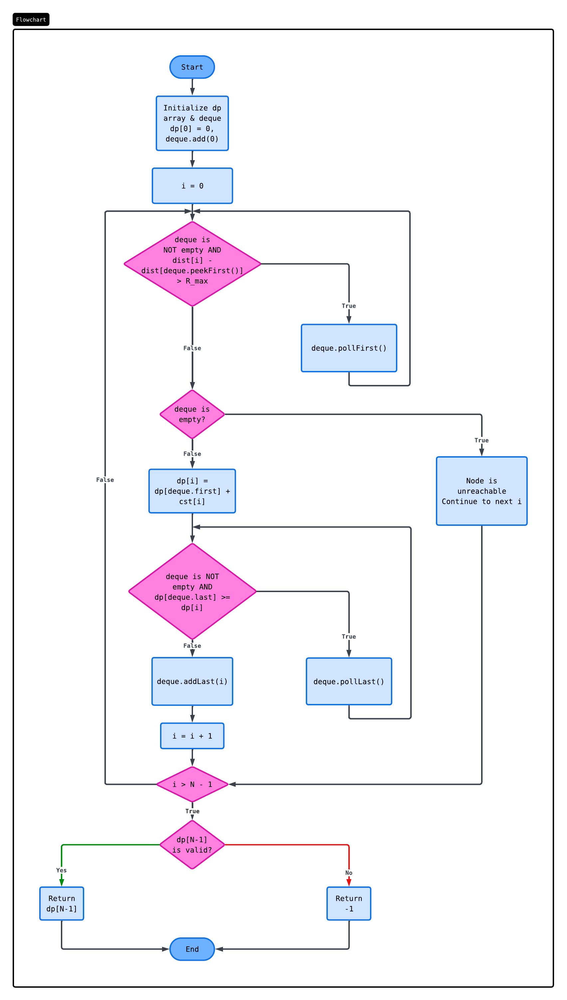

# Optimizing EV Charging Networks

A Dynamic Programming solution to solve the highway range anxiety problem while minimizing installation costs.

## 1. The Problem

### The Scenario
The highway department is planning a massive green infrastructure project. They need to install high-speed EV charging hubs at existing rest stops along a linear highway.

### The Challenge
Range anxiety is a major barrier to EV adoption. If the gap between stations exceeds standard EV range ($R_{max}$), drivers will be stranded. However, installing charging hubs is extremely expensive. Using a naive approach wastes millions in budget.

### The Objective
Find the absolute **minimum total cost** required to build a valid charging network, ensuring no driver ever runs out of battery. If the distance between two necessary rest stops exceeds the EV range, it's impossible, and the program must gracefully return an error.

### Detailed Problem Specification
The highway department needs to select a subset of existing rest stops along a linear highway of length `L` to install high-speed EV charging hubs. The goal is to minimize the total installation cost while ensuring that no two adjacent charging stations are further apart than the maximum driving range of a standard EV.

You are given a 1-dimensional, linear highway of total length `L` kilometers. Along this highway, there are `n` existing rest stops. You are given three inputs:
- `distances`: An integer array of length `n`, where `distances[i]` represents the exact kilometer marker of the `i`-th rest stop from the starting point of the highway. (The array is guaranteed to be strictly increasing: `distances[0] < distances[1] < ... < distances[n-1]`).
- `costs`: An integer array of length `n`, where `costs[i]` represents the financial cost (in RM) to construct a high-speed charging hub at the `i`-th rest stop.
- `R_max`: An integer representing the maximum driving range (in kilometers) of a standard electric vehicle on a full charge.

A vehicle starts at kilometer 0 with a full battery. To ensure a vehicle never runs out of power, the distance from the starting point to the first chosen hub, the distance between any two consecutively chosen hubs, and the distance from the last chosen hub to the end of the highway (`L` km) must not exceed `R_max`. You can choose any subset of the `n` rest stops to build a hub, provided the range feasibility rule is maintained globally across the corridor.

Return the minimum total cost required to build a valid charging network along the highway. If it is physically impossible to bridge the highway under the given `R_max` constraint, return `-1`.

---

## 2. The Algorithm Paradigm

To solve this optimization problem, we model the highway as a **Directed Acyclic Graph (DAG)**. A greedy approach would fail here because choosing the cheapest available stop now might force us into an exorbitantly expensive stop later. Instead, we use **Dynamic Programming (DP)**.

### Recurrence Relation
$$ dp[i] = costs[i] + \min_{\substack{0 \le j < i \\ distances[i] - distances[j] \le R_{max}}} (dp[j]) $$

### Optimization: Monotonic Deque
The basic DP approach involves iterating backwards from the current stop `i` to find the minimum `dp[j]` among all valid previous stops `j` within the range `R_max`. This nested loop results in a time complexity of $\mathcal{O}(N^2)$.

To optimize this to $\mathcal{O}(N)$, we utilize a **Monotonic Deque** (sliding window minimum). The deque maintains a strictly increasing order of `dp` costs for all reachable nodes. Instead of scanning all previous nodes, the optimal cost `dp[j]` is always immediately available at the front of the deque (`deque.peekFirst()`). Nodes that fall out of the `R_max` range are popped from the front, and nodes with higher costs are popped from the back when a cheaper node is inserted, ensuring amortized $\mathcal{O}(1)$ state transitions.

### Optimized Pseudocode
```text
Algorithm: MinimumCostEVNetwork(L, distances, costs, R_max)
Input: 
    L: Integer, total length of the highway
    distances: Array of rest stop distance markers (length n)
    costs: Array of costs to build a hub at each rest stop (length n)
    R_max: Integer, maximum EV driving range
Output: 
    Minimum total cost to reach the end of the highway, or -1 if impossible

// Pre-processing to add Start (0) and End (L) nodes
N ← length(distances) + 2
dist ← new Array(N)
cst ← new Array(N)

dist[0] ← 0
cst[0] ← 0
For i = 0 to length(distances) - 1:
    dist[i+1] ← distances[i]
    cst[i+1] ← costs[i]
dist[N-1] ← L
cst[N-1] ← 0

// DP Initialization
dp ← new Array(N) initialized to Infinity
dp[0] ← 0

// Initialize double-ended queue to store indices of potential previous stops
deque ← new DoubleEndedQueue()
deque.addLast(0)

For i = 1 to N - 1:
    
    // Step 1: Remove indices from the front that are out of EV range
    While deque is not empty AND (dist[i] - dist[deque.peekFirst()]) > R_max:
        deque.pollFirst()
        
    // Step 2: Check if current node is reachable
    If deque is empty:
        continue // Unreachable from any previous valid node
        
    // Step 3: Calculate optimal cost (front of deque always has minimum valid cost)
    bestParent ← deque.peekFirst()
    dp[i] ← dp[bestParent] + cst[i]
    
    // Step 4: Maintain monotonic property of the deque
    // Remove indices from the back if they have a higher or equal cost than the current node
    While deque is not empty AND dp[deque.peekLast()] >= dp[i]:
        deque.pollLast()
        
    // Add current node index to the back of the deque
    deque.addLast(i)

// Return output
If dp[N-1] >= Infinity:
    return -1
Else:
    return dp[N-1]
```

### Algorithm Flowchart


---

## 3. Demonstration & Output

### Test Case 1: An optimal solution is achievable.
**Input Parameters:**
- $L = 1000$ km
- $distances = [200, 400, 600, 800]$
- $costs = [50, 100, 50, 100]$
- $R_{max} = 400$ km

**Console Output:**
```
> java EVNetworkDemo
Minimum Cost: 100
Selected Stops: [200, 600]
```

### Test Case 2: A solution is impossible.
**Input Parameters:**
- $L = 1000$ km
- $distances = [200, 300, 800, 900]$
- $costs = [50, 50, 50, 50]$
- $R_{max} = 400$ km

**Console Output:**
```
> java EVNetworkDemo
Minimum Cost: -1
Selected Stops (distances): []
```

---

## 4. Algorithm Analysis

### Time Complexity: $\Theta(N)$
By substituting a linear search for previous nodes with a Monotonic Deque, the optimization reduces the state transition time from $\mathcal{O}(N)$ per iteration to an **amortized $\mathcal{O}(1)$**. Because there are exactly $N$ insertions across the entire algorithm, there can be at most $N$ deletions. The total time spent across all inner while loops is strictly bounded by $\mathcal{O}(N)$, resulting in an optimal $\Theta(N)$ universally across best, average, and worst-case scenarios.

### Space Complexity: $\Theta(N)$
The solution requires $\mathcal{O}(N)$ space to store the 1D `dp` array, distance arrays, and the path reconstruction array. The Deque data structure stores at most $N$ elements at any given time, requiring an additional $\mathcal{O}(N)$ space.

---

**[View the Live Interactive Portfolio](https://xiaotiangou3.github.io/EVNetworkAlgorithm/)**
